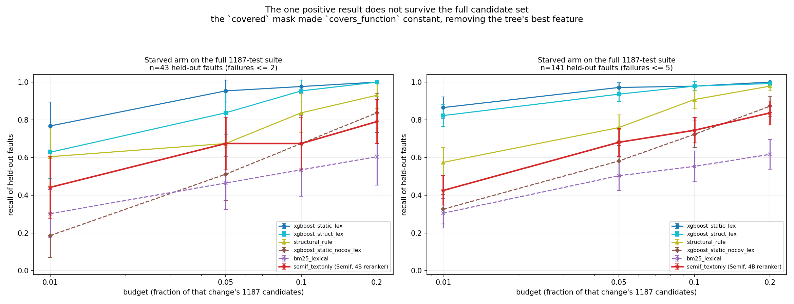
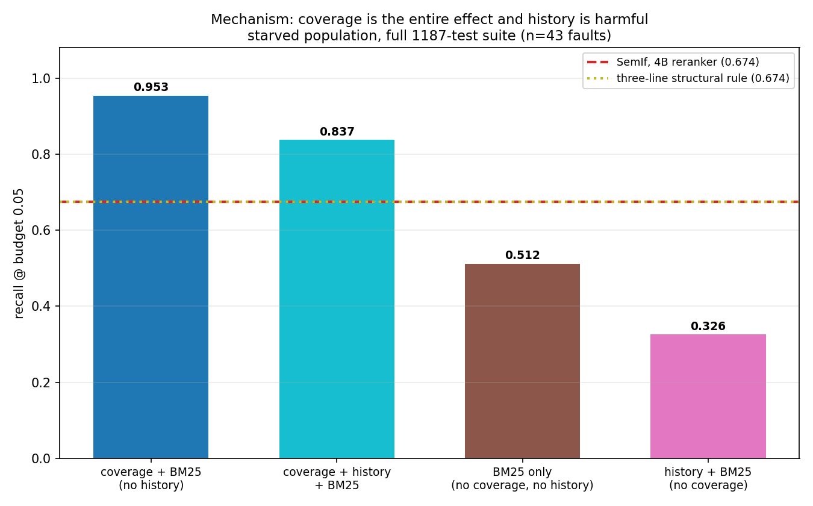
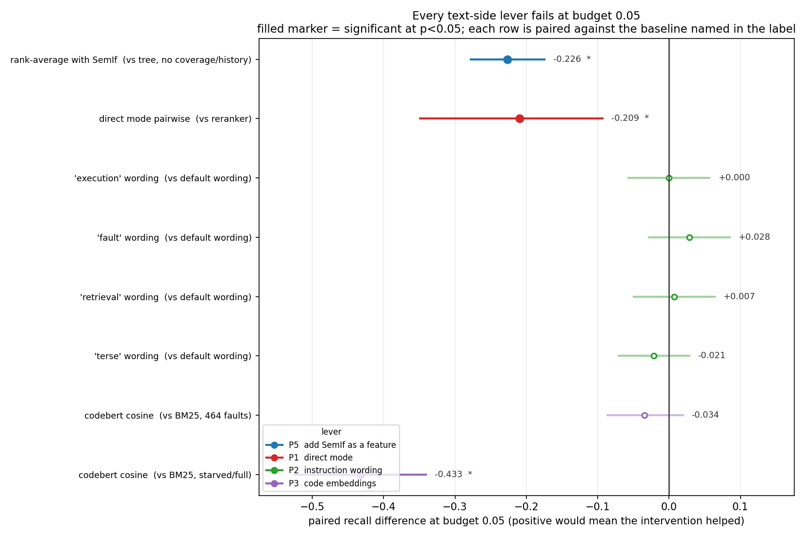

# Implementation

How the RTS feasibility study is built, and what was measured. Study design is in
`plan.md`. Raw numbers for the variation experiments are in `artifacts/variations.json`.

**Bottom line: on this benchmark SemIf loses in every regime where coverage is available, and
wins only once it is removed.** With the full feature set a coverage + BM25 tree reaches
0.908-0.972 recall at budget 0.05 where SemIf reaches 0.681-0.858; remove coverage and
traceability and SemIf leads by **+0.170** (§12). All four text-side levers (features, prompt
wording, code embedding, task formulation) fail. On real BugsInPy bugs, and on a real
boundary-broken corpus (MicroPython), the picture is different again — see §12, which also
corrects two numbers this document previously reported.

---

## 1. Environment

- Workspace `/home/noaha/discriminative_transformer_rts`; Python `/home/noaha/graphrnn_env`
  (3.12.3), reused deliberately rather than creating a second environment.
- **Hardware**: AMD Radeon RX 9070 XT, 17 GB, ROCm. `torch.cuda.is_available()` is True;
  `nvidia-smi` absent. All SemIf numbers were produced on this card.
- **Hugging Face cache** `/home/noaha/hf_cache` — export `HF_HOME` before any score run.
  Three checkpoints, all pinned by revision in `rts/config.py`:
  `Qwen/Qwen3-Reranker-4B` (7.6 GB, main arm), `Qwen/Qwen3.5-4B` (~8 GB, direct mode),
  `microsoft/codebert-base` (~0.5 GB, embedding baseline).
- Packages added: `mutmut` 3.8.0, `coverage`, `simplejson`, `xgboost` 3.4.1,
  `matplotlib` 3.10.8. Pre-existing: `numpy`, `pandas` 3.0.1, `scikit-learn` 1.8.0,
  `pytest` 9.0.3.
- **SemIf installed in place** at pinned commit `23cf1f39fc9534fe81437200959b6dfc7106e45a`
  (`pip install -e .`, base deps only). It moved `numpy` 2.3.5 → 2.2.6 and `protobuf`
  6.33.5 → 7.36.1; `torch` was left untouched so ROCm survived. `[test]` was **not**
  installed because it pins `pytest==8.4.2` and would downgrade the mutmut harness.
  Rollback snapshot: `/home/noaha/graphrnn_env_before_semif.txt`.
- `flash-linear-attention` and `causal_conv1d` were deliberately **not** installed. Their
  absence is why direct mode runs at 1.3 pairs/s instead of ~30 (§8).

## 2. System under test and mutation harness

**SUT**: `marshmallow` at `7f0792bd7a06f72e393ec866ac1e89e1502ccfe1` (branch `dev`,
2026-09-15), cloned to `sut/marshmallow`. Pure Python, minimal dependency tree, pytest
suite, 98% coverage, and logic-dense validation code whose mutants are caught by real
assertions rather than incidental warnings.

**Framework**: `mutmut` 3.8.0. Chosen over `cosmic-ray` because it runs only the tests
associated with the mutated function rather than the whole suite per mutant. Accepted
limitation: mutmut 3 mutates only inside functions with a narrow operator set (`+/-1`,
`<`→`<=`, `break`→`continue`) and cannot produce multi-line mutants. The change-shuffle
ablation and the BM25 baseline are what guard against a purely lexical shortcut.

Config (`sut/marshmallow/setup.cfg`, `[mutmut]`): `source_paths = src/marshmallow`,
`mutate_only_covered_lines = true`, `do_not_mutate = *orderedset.py` (69% coverage, 17 of
the 38 uncovered statements), `also_copy = conftest.py`, and three deselected tests.

```
cd sut/marshmallow && /home/noaha/graphrnn_env/bin/mutmut run --max-children 8
```

### Harness gotchas (each cost time; all fixed)

1. **A root-level `conftest.py` is never collected** — mutmut chdirs into `mutants/` and
   uses it as rootdir, so without `also_copy = conftest.py` the outcome hook silently does
   nothing.
2. **Resolve output paths from the project root, not the cwd** — a cwd-relative path lands
   in `mutants/mutants/` and is wiped.
3. **`MUTANT_UNDER_TEST` sentinels** — besides mutant names it takes `""`,
   `mutant_generation`, `fail`, `stats`. Exclude all or the stats run contaminates the
   outcome table.
4. **Global state leaks between mutmut's in-process runs.** It runs stats, the clean test
   and every worker from one pytest-importing process. This breaks exactly three tests that
   assert on `marshmallow.class_registry` being pristine
   (`test_registry.py::test_serializer_class_registry_register_same_classname_different_module`,
   `test_registry.py::test_serializer_class_registry_override_if_same_classname_same_module`,
   `test_schema.py::test_class_registry_returns_schema_type`). Left in, they fabricate
   "killed" labels for every mutant touching `Schema` subclass registration. Deselected via
   `pytest_add_cli_args`.
5. **Invoke mutmut from the project root** — config loads at import time.

### Per-test outcome capture

No mutation framework records per-test outcomes, so we add it: a plugin in
`sut/marshmallow/conftest.py` hooks `pytest_runtest_logreport`, keys on `MUTANT_UNDER_TEST`,
and writes `{mutant, nodeid, when, outcome}` to `mutmut-test-outcomes.jsonl` (~23 MB).

**Caveat that matters for the labels**: mutmut executes only the tests associated with the
mutated function, so a missing (mutant, test) pair means "not selected", never "passed".
`Dataset.ran` records what actually executed so the two stay distinguishable — and see
§10 for why this makes out-of-coverage faults structurally invisible.

### Verified

- Suite: **1190 tests, 0.75 s**, no flakiness (0.76/0.75/0.75 s over three runs).
- Coverage **98%** (1819 statements, 38 missed).
- Population: **2651 mutants** from 13 files — the full population, no subsampling.
- Verdicts: **2311 killed, 340 survived**, 0 no-tests/timeout/suspicious → mutation score
  **87.2%**. Zero no-tests confirms coverage is high enough that every mutant is actionable.
- Wall clock **79 s** at `--max-children 8` (37.6 mutants/s). Cost is not a constraint.
- Selection is aggressive: median **5 tests per mutant** vs 1190 (~240x reduction); 188
  functions, 19,390 test-function associations.
- Cross-validation: the independent "≥1 failing test" signal agrees with mutmut's killed
  verdict on **2651/2651** mutants, 0 mismatches.
- **Median killing tests per killed mutant is 1** (max 1 across all 2311 faults). Most
  mutants are caught by exactly one test out of 1190, so per-change recall at small budgets
  is low for every model and one test's inclusion flips a mutant from caught to missed.
  Report the distribution, not the mean.

## 3. Data model and evaluation protocol

- **Key formats differ and must be reconciled.** Verdict/outcome keys are
  `marshmallow.utils.x_is_generator__mutmut_1`; coverage keys drop the `__mutmut_N` suffix;
  span keys are file-local. Mangled nesting uses `xǁ`, so the last dot separates module from
  function.
- **Change text** comes from mutmut's trampoline spans: each function has an `__mutmut_orig`
  block plus one block per mutant; diffing them after canonicalizing the trampoline name
  yields the real mutation. All 2651 changes have a non-empty diff.
- **Imposed temporal order.** Mutants have no intrinsic order, so a fixed-seed permutation
  defines the history. This is why `recency` is uninformative by construction — a
  limitation, not a finding.
- **Candidate sets.** `full` = all 1187 tests (realistic RTS). `covered` = only tests
  covering the mutated function, plus that change's killing tests. All selectors are
  evaluated on the same mask.
- **Budget semantics differ by mode.** A budget is a fraction of *that change's own*
  candidate set, so b0.05 means 60 tests in `full` mode but ~8 in `covered` mode. The two
  modes are not comparable.
- **Evaluation.** Per-change budget, recall over fault-bearing changes only (survived
  mutants have no failing test and stay in the dataset only as negative training signal),
  deterministic tie-breaking by test index, 1000-2000 bootstrap resamples, paired bootstrap
  for model-vs-model deltas.
- **Split.** Temporal 80/20: 2121 train / 530 held-out changes, of which **464 are
  fault-bearing**. All history features are cumulative — computed from changes strictly
  before the change being scored.

## 4. Selectors and the SemIf arm

Selectors: `random`, `recency`, `failure_rate`, `coverage`, `structural_rule`
(covers_function ∧ filename match, then shortest test first), `bm25_lexical`, and XGBoost
variants over a 15-feature structured set (coverage, history, size/path) with optional BM25
and optional feature-family exclusions.

**SemIf**: `Qwen/Qwen3-Reranker-4B` @ `22e683669bc0f0bd69640a1354a6d0aebcfeede5`, reranker
mode (each (change, test) pair scored independently, so scores share one global scale).
`rts/semif_runner.py` builds the prompt from the model's native template and imports SemIf's
`PREFIX`/`SUFFIX`/`_answer_ids` so the contract matches the reference implementation. Readout
is the raw yes/no log-odds; the repo's normalization destroys cross-change comparability, so
it is not used. `orientation=change_query` (change as Query, test as Document) — chosen after
a smoke test where `test_query` looked better at n=10, within noise.

## 5. Results

### 5.1 Main benchmark — full candidate set (1187 tests per change, 464 faults)

| model | b0.01 | b0.05 | b0.20 |
|---|---|---|---|
| `xgboost_static` (no history) | 0.907 | **0.983** | 1.000 |
| `xgboost_struct_lex` | 0.907 | 0.981 | 0.998 |
| `xgboost_struct` | 0.886 | 0.970 | 1.000 |
| `structural_rule` | 0.539 | 0.800 | 0.976 |
| `coverage` | 0.425 | 0.597 | 0.888 |
| `bm25_lexical` | 0.248 | 0.381 | 0.515 |
| `recency` | 0.093 | 0.381 | 0.804 |
| `failure_rate` | 0.062 | 0.179 | 0.700 |
| `random` | 0.004 | 0.039 | 0.194 |

Paired vs `coverage` at b0.05 (n=464): `xgboost_struct` +0.373 [+0.325, +0.414],
`structural_rule` +0.203 [+0.157, +0.246], `bm25_lexical` -0.216 [-0.272, -0.164],
`random` -0.558. All p < 0.0001.

### 5.2 Covered candidate set (mean 155 tests per change, 464 faults)

| model | b0.01 | b0.05 | b0.20 |
|---|---|---|---|
| `xgboost_struct_lex` | 0.554 | 0.705 | 0.894 |
| `xgboost_static` | 0.541 | 0.692 | 0.888 |
| `xgboost_struct` | 0.472 | 0.631 | 0.862 |
| `failure_rate` | 0.381 | 0.547 | 0.819 |
| `recency` | 0.203 | 0.384 | 0.754 |
| `structural_rule` | 0.179 | 0.289 | 0.504 |
| `bm25_lexical` | 0.203 | 0.269 | 0.429 |
| `random` | 0.052 | 0.073 | 0.239 |
| `coverage` | 0.043 | 0.073 | 0.190 |

**This mask is degenerate for the coverage baselines** — every candidate already covers the
mutated function, so `covers_function` is constant within the pool and `coverage` collapses
to 0.043/0.073. Any learned-vs-coverage comparison must be run with `--candidates full`
(§5.7). This was the source of the study's one wrong positive result.

### 5.3 SemIf text-only arm (covered candidates, 464 faults)

| model | b0.01 | b0.05 | b0.10 | b0.20 |
|---|---|---|---|---|
| `xgboost_struct_lex` | 0.554 | **0.705** | 0.823 | 0.894 |
| `xgboost_static_nocov_lex` | 0.489 | 0.655 | 0.750 | 0.869 |
| `xgboost_struct` | 0.472 | 0.631 | 0.759 | 0.862 |
| `xgboost_static_nocov` (no coverage, no history, no text) | 0.418 | 0.569 | 0.679 | 0.823 |
| `failure_rate` | 0.381 | 0.547 | 0.681 | 0.819 |
| **`semif_textonly`** | **0.226** | **0.306** | **0.377** | **0.511** |
| `structural_rule` | 0.179 | 0.289 | 0.375 | 0.504 |
| `bm25_lexical` | 0.203 | 0.269 | 0.336 | 0.429 |
| `random` | 0.052 | 0.073 | 0.142 | 0.239 |

Paired vs `xgboost_struct` at b0.05: `semif_textonly` -0.325 [-0.390, -0.265] p<0.0001;
`bm25_lexical` -0.362; `structural_rule` -0.343; `failure_rate` -0.084 p=0.002;
`xgboost_static` +0.060 [+0.026, +0.093]. SemIf vs BM25: **+0.037 [-0.002, +0.080],
p=0.068** — not significant, and see §8: that difference is undetectable at any feasible n.

Three things this establishes: SemIf with raw text is statistically indistinguishable from
BM25 and from a three-line structural rule; a tree with **no coverage, no history and no
text** still beats it by ~1.9x; and the lexical signal is real but far better used as a
feature than as a prompt.

### 5.4 Sparsity sweep (panels A and C)

Faults binned into equal-count deciles by how much failure history their killing
`(file, test)` pair has (decile 1 = sparsest). Figures: `artifacts/figures/panel_A_C_budget*.png`;
code in `rts/analysis.py`. Recall @0.05:

| model | decile 1 | decile 10 | trend |
|---|---|---|---|
| `failure_rate` | **0.000** | **0.964** | strong monotone up |
| `xgboost_struct_lex` | 0.083 | 0.946 | strong monotone up |
| `recency` | 0.104 | 0.839 | up |
| `semif_textonly` | 0.292 | 0.143 | noisy, slight down |
| `structural_rule` | 0.208 | 0.214 | flat |
| `coverage` | 0.000 | 0.000 | flat at zero (degenerate mask) |

State the claim narrowly: *history-based* classical methods lose their footing as data
thins; **structure-only** methods do not, because they never used history.

**Panel C refuted the hypothesised mechanism.** The prediction was that the killer falls
outside the structural funnel as sparsity rises; the funnel fraction is in fact **flat**
(0.417 decile 1 vs 0.411 decile 10), and funnel *size* moves inverted from the guess (5.5
tests in decile 1 vs 134 in decile 10). What actually tracks the crossover is whether the
killing test is the file's **usual suspect**: history finds usual suspects, and semantics is
the only thing that could find an unusual one.

### 5.5 Prompt placement controls: the "mirror degradation" was a position artifact

Feeding SemIf the structured features *before* the content degrades it by up to -0.213; the
cause is position, not information. Starved subset (141 changes), tokens added in brackets,
and the paired delta vs text-only at b0.05:

| arm | added | b0.05 | vs textonly |
|---|---|---|---|
| `after_document` (identical features, placed after `<Document>`) | +202 | **0.454** | +0.035 n.s. |
| `textonly` (reference) | 0 | 0.418 | — |
| `informative` (only the 8 features that vary across candidates) | +143 | 0.255 | -0.163 **sig** |
| `placebo` (same field names/length, every value `n/a`) | +183 | 0.213 | -0.206 **sig** |
| `shuffled` (real values, decorrelated from the candidate) | +204 | 0.213 | -0.206 **sig** |
| `full` (all 15 features, before the content) | +202 | 0.206 | -0.213 **sig** |

1. **Information content is irrelevant** — a block with *zero* information (`placebo`) hurts
   exactly as much as the real one.
2. **Position is the mechanism** — the same features after the Document are
   indistinguishable from text-only, and are the best SemIf configuration at b0.01.
3. **Length explains the residual ordering** (+143 > +183 ≈ +202): more tokens before the
   content is monotonically worse.

This is the signature of a reranker that reads the final position: pushing Query/Document
away from the end dilutes the signal it was trained to read. Consequence for design: any
prompt-side addition belongs *after* the content.

### 5.6 Change complexity

Bundling a killed mutant with **survived** distractors broadens the change while keeping the
label exact. 200 held-out bundles, recall @0.05:

| change | files | SemIf | BM25 | XGBoost | structural | random |
|---|---|---|---|---|---|---|
| 1 mutation (baseline) | 1 | 0.305 | 0.235 | 0.550 | 0.280 | 0.090 |
| 6 mutations | 1 | 0.235 | 0.145 | 0.560 | 0.280 | 0.090 |
| 6 mutations | 3.8 | **0.190** | 0.160 | 0.525 | 0.300 | 0.090 |
| 6 mutations, coherent | 2.6 | **0.160** | **0.185** | 0.555 | — | — |

- **Complexity hurts text models and leaves structural models untouched** (XGBoost is flat
  even at 3.8 files). Mechanism: query dilution — the bundled diff concatenates unrelated
  edits, so distractor terms wash out signal terms. Same effect as the placement controls.
- **The pre-registered falsifier failed.** If the reranker's semantic reading were worth
  anything, its margin over bag-of-words should *grow* with complexity. It shrinks
  monotonically and inverts: +0.070 (1 mutation) → +0.090 (6, 1 file) → +0.030 (6, 3.8
  files, n.s.) → **-0.025** (coherent, n.s.).
- **Coherence does not rescue it**: coverage-profile Jaccard rises 0.008 → 0.441 but SemIf
  gets numerically worse, and BM25 overtakes it.
- **Rung 4 (killed distractors) confirms the killer-count trap**: with 5 *killed*
  distractors `random` jumps 0.090 → 0.360 and XGBoost to 0.975. More killing tests makes
  RTS easier, which is why survived distractors are the right manipulation.
- Confounds: rung 5 has 2.56 files/bundle vs rung 3's 3.80; bundling lengthens the change
  text; distractors are reused ~30x. Distractors are semantically *unrelated*, which is the
  worst case for a text model and a neutral case for coverage — real commits are usually
  coherent, so this manipulation may be unfairly adversarial to text.
- Tripling the candidate pool (158 → 490) leaves XGBoost flat (0.550 → 0.570) and degrades
  the structural rule modestly (0.280 → 0.190). Conclusion unchanged under the realistic pool.

### 5.7 The starved arm, and its correction

The starved filter targets the data-starved deployment regime: changes whose killing
`(file, test)` pair has almost no failure history. `failures <= 2` gives 43 held-out faults,
`failures <= 5` gives 141.

**Measured inside the `covered` mask, SemIf appeared to win** — 0.442 vs 0.256 for the best
XGBoost at b0.05, leading at every budget, monotone in starvation. **That result does not
survive.** Re-scored against the full 1187-test suite (`--candidates full`):



n=43, 1187 candidates per change (k = 12/60/119/238), 51,041 pairs:

| model | b0.01 | b0.05 | b0.10 | b0.20 |
|---|---|---|---|---|
| **`xgboost_static_lex`** (coverage + BM25, **no history**) | **0.767** | **0.953** | **0.977** | **1.000** |
| `xgboost_struct_lex` (history + coverage + BM25) | 0.628 | 0.837 | 0.953 | 1.000 |
| `xgboost_struct` | 0.535 | 0.767 | 0.930 | 1.000 |
| `structural_rule` | 0.605 | 0.674 | 0.837 | 0.930 |
| `coverage` | 0.395 | 0.581 | 0.674 | 0.791 |
| `xgboost_static_nocov_lex` (BM25 only) | 0.186 | 0.512 | 0.674 | 0.837 |
| **`semif_textonly`** | **0.442** | **0.674** | **0.674** | **0.791** |
| `rankaverage_xgb_semif` | 0.442 | 0.628 | 0.721 | 0.884 |
| `xgboost_struct_nocov_lex` (history + BM25) | 0.186 | 0.326 | 0.419 | 0.674 |
| `failure_rate` | 0.000 | 0.023 | 0.116 | 0.140 |
| `random` | 0.000 | 0.047 | 0.093 | 0.186 |

**The best classical selector is the one with the fewest features.** A 2×2 over
{coverage, history} with BM25 always on:



| model | coverage | history | BM25 | b0.05 |
|---|---|---|---|---|
| `xgboost_static_lex` | yes | no | yes | **0.953** |
| `xgboost_struct_lex` | yes | yes | yes | 0.837 |
| `xgboost_static_nocov_lex` | no | no | yes | 0.512 |
| `xgboost_struct_nocov_lex` | no | yes | yes | 0.326 |

**Coverage is the entire effect**: adding it to BM25 moves 0.512 → 0.953 (+0.441), which
measures the mask mechanism directly rather than inferring it. And **history is worse than
useless in this population**: it costs 0.116 with coverage and 0.186 without, because the
starved filter removed the signal those features carried and left noise. The strongest
baseline is therefore four columns (`covers_function`, `n_covering_tests`,
`coverage_rank_prior`, `bm25`).

Paired, SemIf as reference (n=43):

| comparison | b0.01 | b0.05 | b0.10 | b0.20 |
|---|---|---|---|---|
| vs `xgboost_static_lex` (**strongest**) | **-0.326** p<0.0001 | **-0.279** p<0.0001 | **-0.302** p<0.0001 | **-0.209** p<0.0001 |
| vs `structural_rule` | -0.163 p=0.090 | 0.000 p=1.000 | -0.163 p=0.052 | -0.140 p=0.032 |
| vs `xgboost_static_nocov_lex` | +0.256 p<0.0001 | +0.163 p=0.051 | 0.000 p=1.000 | -0.047 p=0.733 |

**n=141 confirmation** (`failures <= 5`, 141 faults, 167,367 pairs — only the 98 changes not
already scored needed scoring, via `--exclude-scored`, 116,326 pairs in 62 min):

| model | b0.01 | b0.05 | b0.10 | b0.20 |
|---|---|---|---|---|
| **`xgboost_static_lex`** | **0.865** | **0.972** | **0.979** | **1.000** |
| `xgboost_struct_lex` | 0.823 | 0.936 | 0.979 | 0.993 |
| `structural_rule` | 0.574 | 0.759 | 0.908 | 0.979 |
| `rankaverage_xgb_semif` | 0.532 | 0.723 | 0.787 | 0.901 |
| `xgboost_static_nocov_lex` (BM25 only) | 0.326 | 0.582 | 0.723 | 0.872 |
| **`semif_textonly`** | **0.426** | **0.681** | **0.745** | **0.837** |
| `bm25_lexical` | 0.305 | 0.504 | 0.553 | 0.617 |

| comparison (n=141) | b0.01 | b0.05 | b0.10 | b0.20 |
|---|---|---|---|---|
| vs `xgboost_static_lex` | **-0.440** p<0.0001 | **-0.291** p<0.0001 | **-0.234** p<0.0001 | **-0.163** p<0.0001 |
| vs `structural_rule` | **-0.149** p=0.004 | -0.078 p=0.121 | **-0.163** p<0.0001 | **-0.142** p<0.0001 |
| vs `xgboost_static_nocov_lex` | **+0.099** p=0.015 | **+0.099** p=0.025 | +0.021 p=0.68 | -0.035 p=0.44 |

The larger arm **strengthens** the correction and resolves the two soft cells against SemIf:
the b0.05 tie with the structural rule was noise, and at n=141 a rule with no model, no
training and no text beats SemIf at three of four budgets. SemIf's residual edge over the
BM25-only tree survives only at the two tightest budgets (+0.099, p=0.015/0.025) and is gone
by b0.10 — that ~0.10 at b≤0.05 is the entire contribution of a 4B reranker over
bag-of-words on this benchmark. The n=43 arm was generous to SemIf, not unrepresentative.

**Robustness.** Refitting both trees under four seeds gives 32 SemIf-minus-tree deltas, **all
32 negative**, between -0.163 and -0.349; the reported seed sits at the mild end. SemIf is
deterministic, so there is no SemIf-side seed; the dataset seed fixes the imposed order and
the split, and the caches are keyed to that order, so it cannot be varied without breaking
the pairing.

Precision/F1/suite-reduction at b0.05 (n=43): `xgboost_struct_lex` 0.014/0.027/0.949,
`structural_rule` 0.011/0.022/0.949, `semif_textonly` 0.011/0.022/0.949, `bm25_lexical`
0.008/0.015/0.949. Suite reduction is identical for every selector by construction — the
budget fixes how many tests are selected, so it is a property of the budget, not the model.
Precision is tiny for everyone because there is exactly one killing test per fault while
b0.05 selects ~60 tests. Recall is the discriminating metric here.

### 5.8 Variation experiments

All ten paired deltas at b0.05, one per intervention, against the baseline each was designed
to beat:



*Nothing is positive and significant: four levers move nothing, three move it the wrong way.*

**P5 — is the transformer redundant? Mostly yes.** A trained column needs SemIf scores on
training rows (329k extra pairs, ~3 h), so two cheaper arms were used.

*Fitted-free rank average* (464 faults, covered): averaging SemIf's per-change rank with the
tree's is **worse than either parent** at every budget — -0.226 [-0.278, -0.175] p<0.0001 vs
`xgboost_static_nocov_lex` (0.700 → 0.474 at b0.05), -0.121 vs `xgboost_struct`. As an
equal-weight partner SemIf is net negative, not merely redundant.

*Trained column* (`--only p5_trained`), leakage-free temporal split inside the held-out
window: train on 371 held-out changes, evaluate on 159 (140 fault-bearing), baseline trained
on identical rows. Adding the column to `struct_lex` gives **+0.100 p=0.007** at b0.01 and
**+0.079 p=0.010** at b0.05, nothing at b0.10/0.20; adding it to `static_nocov_lex` gives
nothing anywhere (p=0.11-0.91). `semif` ranks 5th of 11 features (0.108) in the cheap model
and 5th of 17 (0.059) in the full one.

Verdict: a small, real, non-linear contribution on top of the *richest* feature set, capped
at +0.08 at b0.05, against the +0.394 that `xgboost_static_nocov_lex` already scores over
SemIf. Under a Bonferroni correction for the eight cells tested, p=0.007 and p=0.010 do not
survive. Redundant to within a small residual.

**P2 — instruction sweep: a clean null.** Five wordings on the starved 141 (covered, 22,199
pairs each, ~13 min per arm):

| variant | what it changes | b0.01 | b0.05 | b0.10 | b0.20 |
|---|---|---|---|---|---|
| `default` | reference | **0.326** | 0.418 | 0.539 | **0.674** |
| `execution` | the diagnosis made explicit: ask about observable runtime behaviour | 0.298 | 0.418 | 0.546 | 0.660 |
| `fault` | ask for the prediction directly | 0.305 | **0.447** | **0.567** | 0.638 |
| `retrieval` | **negative control**: lean into the native topical-relevance prior | 0.298 | 0.426 | 0.560 | 0.631 |
| `terse` | shortest possible question | 0.312 | 0.397 | 0.560 | 0.660 |
| `bm25_lexical` | reference | 0.284 | 0.355 | 0.397 | 0.553 |
| `xgboost_static_nocov_lex` | reference | 0.298 | 0.468 | 0.539 | 0.674 |

**All 16 comparisons against `default` are non-significant** (every p ≥ 0.15; largest delta
+0.028). The null holds on the sparser 43-change subset too (largest delta +0.047, all
p ≥ 0.56). Three readings: wording is not the lever; the *sharpest* form of the test fails
(`execution` delta exactly 0.000, so the model was not merely asked the wrong question); and
leaning into the native prior does not help either — the model is **insensitive to which
relation it is asked about**, consistent with falling back on lexical overlap regardless of
instruction. Note the contrast with §5.5: position and length matter enormously, ~40 tokens
of changed wording do not.

**P3 — code-specialised embedding baseline: below BM25.** Mean-pooled `codebert-base`,
L2-normalised, cosine between change text and test source, same pairs and masks, no training,
no prompt, CPU-only.

| regime | model | b0.01 | b0.05 | b0.10 | b0.20 |
|---|---|---|---|---|---|
| 464 held-out, covered | `bm25_lexical` | 0.203 | 0.269 | 0.336 | 0.429 |
| | `embed_codebert` | 0.157 | 0.235 | 0.295 | 0.427 |
| starved ≤5, covered | `bm25_lexical` | 0.284 | 0.355 | 0.397 | 0.553 |
| | `embed_codebert` | 0.106 | 0.170 | 0.241 | 0.390 |
| starved ≤5, **full** | `bm25_lexical` | 0.305 | 0.504 | 0.553 | 0.617 |
| | `embed_codebert` | 0.021 | 0.071 | 0.156 | 0.298 |
| starved ≤5, full | `structural_rule` | 0.574 | 0.759 | 0.908 | 0.979 |

Paired, embedding minus BM25: -0.034 (p=0.22, n=464), -0.184 (p<0.0001, n=141), -0.433
(p<0.0001, n=141). A code-specialised encoder is *further* from useful than bag-of-words, so
the weakness is not the reranker architecture. Caveats: `codebert-base` is a 110M 2019 model
trained on NL-PL pairs, a floor for the family rather than a ceiling; and cosine similarity
has no notion of causality — the same limitation the reranker diagnosis identified.

**P1 — direct mode, pairwise: worse than the reranker.** Direct mode (`--mode direct`) states
a criterion and reads native next-token logits on option letters — a decision rather than a
relevance rating, i.e. a change of task formulation rather than of model. Adapted to two
options so it produces a global ranking, on the starved 43 with covered candidates (8,329
pairs, 104 min at 1.3 pairs/s):

| model | b0.01 | b0.05 | b0.10 | b0.20 |
|---|---|---|---|---|
| `semif_reranker` (pairwise relevance) | **0.302** | **0.442** | **0.535** | **0.628** |
| **`semif_direct_pairwise`** (decision) | 0.140 | 0.233 | 0.326 | 0.465 |
| `xgboost_static_nocov_lex` | 0.070 | 0.256 | 0.326 | 0.442 |
| `bm25_lexical` | 0.209 | 0.233 | 0.302 | 0.419 |

| comparison (n=43) | b0.01 | b0.05 | b0.10 | b0.20 |
|---|---|---|---|---|
| direct vs reranker | **-0.163** p=0.002 | **-0.209** p=0.001 | **-0.209** p=0.006 | **-0.163** p=0.024 |
| direct vs `xgboost_static_nocov_lex` | +0.070 p=0.26 | -0.023 p=0.88 | 0.000 p=1.00 | +0.023 p=0.90 |

Direct mode is significantly **worse** at every budget and lands level with the cheap tree.
It is not a context-length effect: the direct prompt is *smaller* (328 vs 345-421 tokens).
Caveat: this is direct mode adapted to **two** options; the repo's native 2-16-option windowed
form is untested, because a window is only comparable within itself and the complexity ladder
predicts a ~12k-token multi-topic window would hurt for reasons unrelated to semantics.

## 6. Findings

1. **The task is dominated by non-semantic structure.** On the full candidate set XGBoost
   reaches 0.970-0.983 at b0.05 against 0.597 for coverage and 0.381 for BM25. The
   conjunction `covers_function ∧ filename match` narrows the suite to a median of 9
   candidates, and a three-line rule using only that plus "shortest test first" scores 0.800.
   The hard part is the funnel, not the ranking.
2. **Coverage is the single dominant signal when the candidate set is realistic**: adding it
   to BM25 moves 0.512 → 0.953 on the full-suite starved arm (+0.441). Everything else is
   worth little or nothing.
3. **History features contribute nothing, and are harmful under starvation** (-0.116 with
   coverage present, -0.186 without). The synthetic history over-repeats `(file, test)` pairs
   ~159x (median), so the features were never going to be trustworthy here.
4. **The lexical signal is real, change-specific, and weak.** BM25 0.381 vs random 0.039; the
   change-shuffle ablation collapses it to 0.075 and the test-shuffle to 0.078, so it is
   matching a specific change to a specific test rather than exploiting a test prior.
5. **SemIf does not beat the classical selectors in any regime tested.** Covered/464: 0.306 vs
   0.631 (-0.325 p<0.0001). Full-suite starved: 0.674 vs 0.953 (n=43) and 0.681 vs 0.972
   (n=141), losing at every budget p<0.0001; it also loses to the three-line structural rule
   at three of four budgets at n=141.
6. **The one apparent exception was an artifact of the candidate mask.** The starved "win" was
   measured where `covers_function` is constant, which removes the tree's best feature. The
   mechanism is measured, not inferred (§5.7), robust across seeds, and it strengthens with n.
7. **All four text-side levers fail**: adding SemIf as a feature (P5), rewording the question
   (P2), a code-specialised encoder (P3), and re-framing the task as a decision (P1). The
   diagnosis — the model's learned relation is topical relevance, the task's relation is
   executional and causal — is supported by four independent negative results.
8. **SemIf is insensitive to the relation it is asked about** but **highly sensitive to prompt
   position**: ~200 tokens of zero-information text before the content costs 0.21 recall, while
   five different wordings move nothing. Any prompt-side addition must go after the content.
9. **Complexity hurts text models and not structural ones**, and the SemIf−BM25 margin
   collapses to non-significance by 3.8 files and turns numerically negative under coherence —
   the pre-registered falsifier for the semantic hypothesis, failed.
10. **What the study establishes positively** is the size of the classical floor: four columns
    (coverage + BM25) reach 0.953-0.972, and a three-line rule reaches 0.759-0.800, with no GPU
    and no model download.

## 7. Corrections and negative results (do not re-try these)

- **The `covered` mask is degenerate for coverage baselines.** It made `coverage` read 0.000
  in every sparsity bin and produced the study's one wrong positive result. Use
  `--candidates full` for any learned-vs-coverage comparison.
- **Feature importances were wrong once and are unstable.** The original selector trained on
  all 1187 tests per change, so `covers_function` scored 0.714 by separating candidates from
  non-candidates — a job that does not exist at evaluation time. Training on candidate pairs
  gives no dominant feature (top: `coverage_rank_prior` 0.42, `test_last_failure_age` 0.13,
  `test_duration` 0.06) with recall essentially unchanged (0.631 → 0.616). Importances also
  shift with the feature set (`name_match_any` becomes top at 0.17-0.22 in the bundle ladder).
  **Trust ablations, not importances.**
- **The mirror arm's "degradation" was a position artifact** (§5.5) — the features are
  neutral when placed after the content.
- **Funnel size was not the sparsity mechanism** (§5.4) — the funnel fraction is flat, and the
  funnel is *larger* in dense bins, inverted from the prediction.
- **Batched bf16 scoring is not bitwise reproducible.** Re-scoring the same pairs in a
  different batch configuration changes log-odds by up to 0.5 on the bf16 grid (multiples of
  1/64; **median difference exactly 0** across the 8,329 shared pairs). Substituting one
  cache's values for the shared pairs moves SemIf's b0.05 recall 0.674 → 0.651, i.e.
  **±0.02 recall**. Do not read differences below ~0.03 as findings.
- **Length bucketing does not help.** Sorting pairs by length before batching cut padding only
  8% (483 → 442 tokens/pair) while costing ~18% throughput (21.3 → 17.6 pairs/s): the run is
  compute-bound on the forward pass, not padding-bound. `bucket_by_length` defaults to off.
- **Candidate-only training is a real improvement** and is now the default in the variation
  experiments: it raises `xgboost_static_nocov_lex` from 0.655 to 0.700 at b0.05. The
  documented 0.631 for `xgboost_struct` is unaffected (0.6315 reproduced).
- **P6 (prompt-side dilution mitigation) is subsumed by P2**: wordings that differ by ~40
  tokens change nothing, so the measured dilution is a position effect, not a content effect.

## 8. Cost, throughput and sizing

Measured on this card. SemIf scores are cached, so scoring is a one-time cost per arm and
everything downstream is CPU-only (~45 s for the full pipeline once training is restricted to
candidate pairs, down from ~2.7 min).

| configuration | throughput | notes |
|---|---|---|
| reranker, batch 8, unsorted | **30.1 pairs/s** | 344.7 padded tokens/pair — the fastest found |
| reranker, batch 16 | 22.3-22.8 pairs/s | 421 tokens/pair |
| reranker, bucketed | 17.6 pairs/s | negative result, see §7 |
| **direct mode** (Qwen3.5-4B) | **1.3 pairs/s** | 328 tokens/pair; reference kernels, ~23x penalty |

Cost is therefore `pairs / 30` seconds for the reranker. The repo's published 1.86
decisions/s (batch-1, no batching) is ~16x too slow an estimate for batched scoring and was
the basis of a 61 h cost projection that is superseded.

Scoring-size guidance at 20 pairs/s and ~155 covered candidates per change: 43 changes ≈
6.7k pairs (6 min, detects effects ≥0.35); **141 changes ≈ 21.8k pairs (18 min, detects
≥0.20)**; 250 ≈ 32 min (≥0.15); 464 ≈ 60 min (≥0.08). The 141-change starved population is
the sweet spot because it is a superset of the 43-fault one, so a single run serves both.

**Power limits that shape the design.** The starved populations are fixed (43 and 141 are the
whole population) and cannot be subsampled. `--pilot N` takes the first N held-out faults by
index, which is a temporal slice, not a random sample. Any prompt change invalidates its
cache, so the instruction sweep is the one lever that cannot be amortised. And the
SemIf-vs-BM25 difference (0.037) is undetectable at any feasible n on this benchmark — that
comparison will always return "not significant" as a power limit, not as evidence of
equivalence.

## 9. Reproducing

```
cd /home/noaha/discriminative_transformer_rts
python -m rts.artifacts / rts.dataset / rts.features      # sanity checks + stats
python -m rts.pipeline --bootstrap 1000                   # full candidate set
python -m rts.pipeline --bootstrap 1000 --candidates covered
python -m rts.bundles --cpu --plot                        # change-complexity ladder
python -m rts.analysis                                    # sparsity panels A and C
```

SemIf arms write resumable JSONL caches, so a re-run continues rather than restarts. Only one
4B model fits in 17 GB, so arms run sequentially; `scripts/run_variation_arms.sh` queues them.

```
python -m rts.semif_runner --heldout                                    # text-only
python -m rts.semif_runner --heldout --candidates full --starved 2 \
  --out artifacts/semif_scores_starved2_full.jsonl                      # the correction
python -m rts.semif_runner --heldout --candidates full --starved 5 \
  --exclude-scored artifacts/semif_scores_starved2_full.jsonl \
  --out artifacts/semif_scores_starved5_extra_full.jsonl                # n=141, 98 new changes
python -m rts.semif_runner --heldout --starved 5 --instruction execution \
  --out artifacts/semif_scores_instr_execution_starved5.jsonl           # P2, ×4 wordings
python -m rts.embed --device cpu                                        # P3
python -m rts.direct_runner --starved 2 --out artifacts/semif_direct_starved2_covered.jsonl  # P1
```

```
python -m rts.variations --only full_starved full_starved5 full_starved_seeds p5 p5_trained p2 p3 p1
python -m rts.figures        # reads variations.json, writes artifacts/figures/*.png
```

## 10. Limitations and risks

- **Labels are defined by coverage, so out-of-coverage faults are invisible.** mutmut runs
  only the tests associated with the mutated function, so any fault whose real killer does not
  cover the changed function is recorded as "never ran" and treated as not failing. The
  recorded invariant ("0 killing tests fall outside the coverage set") is therefore true *by
  construction, not by discovery*. This is the benchmark's most consequential limitation: it
  structurally excludes the integration-test failure mode, where a change in one module
  surfaces in a test that drives the whole stack. Fixing it is cheap here — the full suite is
  0.75 s, so running it for all 2651 mutants is ~33 min CPU / ~5 min wall-clock at 8 workers —
  and is the first proposed next step.
- **Exactly one killing test per fault** (max 1 across 2311). Real RTS has several failing
  tests per change, where recall is far more forgiving and a structural funnel gets partial
  credit. The rung-4 control shows more killers makes RTS *easier* (random 0.090 → 0.360), so
  this property likely compresses differences rather than favouring any model.
- **`covered` candidate mask** in most SemIf numbers: presupposes per-test coverage, exactly
  the data a starved deployment may not have. Repaired by the full-suite arm; `--candidates
  full` should be the default for any future comparison.
- **Imposed temporal order and a single revision.** No real code evolution, no cross-revision
  drift, and `recency` is degenerate by construction — do not report it as a result.
- **One SUT, one language, one project.** marshmallow is well known, so pretraining
  contamination cannot be ruled out; state it as a limitation rather than trying to fix it.
- **Batched bf16 non-reproducibility** (±0.02 recall) — see §7.
- **Feature importances are unstable** — see §7.
- **The starved filter could not be tested in full.** Applying the `max_runs` half of the
  "file unchanged for years *and* test run once or twice" condition collapses the sample:
  27/15/8 held-out faults at runs ≤40/≤20/≤10. The failure cap alone is the practical proxy.
- **The starvation threshold was chosen after seeing the data.** Thresholds 1/2/3/5/8 were
  explored and 2 and 5 reported. The monotone trend and the n=141 confirmation mitigate this
  but do not remove it; a pre-registered threshold would be stronger. The 43- and 141-fault
  populations are the entire population, so they cannot be subsampled either.
- **Query/Document orientation was only tested at n=10**, where the two options were within
  noise (4/10 vs 6/10 for ranking a known killer first). Every cached arm uses
  `change_query`; an adequate-n re-test was never run. This matters less than it looks — P2
  shows the model is insensitive to how the question is phrased — but it is untested.

## 11. Status and handoff

### Bottom line

**SemIf does not win in any regime tested, and it never becomes competitive.** The corrected
answer is a clean no rather than the equivocal one the study previously reported.

| regime | SemIf | best classical | verdict |
|---|---|---|---|
| full held-out, 464 faults, covered | 0.306 | 0.700 XGBoost | loses 2.3x |
| starved `failures <= 5`, 141 faults, **full suite** | 0.681 | **0.972** XGBoost | **loses 1.4x** |
| starved `failures <= 2`, 43 faults, **full suite** | 0.674 | **0.953** XGBoost | **loses 1.4x** |
| starved `failures <= 2`, 43 faults, covered | 0.442 | 0.256 XGBoost | "won" 1.7x — **artifact of the mask** |
| 6 mutations, cross-file | 0.190 | 0.525 XGBoost | loses |
| 6 mutations, coherent | 0.160 | 0.555 XGBoost | loses, and BM25 overtakes it |

(all at budget 0.05)

| lever | outcome |
|---|---|
| **P5** SemIf as a feature | Near-redundant; equal-weight blending hurts (-0.226, p<0.0001); a trained column adds +0.08 to +0.10 at the two smallest budgets only, and fails correction. |
| **P2** instruction sweep, 5 wordings | Clean null, 16/16 non-significant, at both starvation thresholds. |
| **P3** code-specialised embedding | Below BM25 in every regime (0.071 vs 0.504 starved/full). Not an architecture problem. |
| **P1** direct mode, pairwise | Significantly worse than the reranker at every budget (-0.163 to -0.209); lands level with the cheap tree. |
| **P6** dilution mitigation | Subsumed by P2 — the dilution is a position effect, not a content effect. |

### Completed

Synthetic change history from mutmut (2651 mutants, 2311 killed, exact per-test labels);
evaluation harness (per-change budgets, temporal split, paired bootstrap, shuffle ablations,
sparsity sweep, complexity ladder, coherent bundles, embedding baseline, direct-mode arm);
four SemIf reranker arms over all 530 held-out changes plus four diagnostic controls; the
full-suite starved arm at n=43 and n=141; a history×coverage decomposition and a four-seed
robustness check; five instruction wordings; and figures for the correction, the mechanism and
the levers. New machinery: `rts/semif_runner.py` (instruction variants, full/starved/train-prefix
arms, `--exclude-scored`), `rts/direct_runner.py`, `rts/embed.py`, `rts/variations.py`,
`rts/figures.py`, `scripts/run_variation_arms.sh`.

### Next steps, in priority order

> The same agenda, in a form meant to be read on its own, is in `plan.md` under **Next steps**.
> Keep the two in sync if either changes.
>
> **Superseded in part by `plan_next_steps.md`, which is the detailed execution plan.** The
> target regime is now specified as a test suite driving an embedded system across a boundary,
> and that plan retires proposal 2 (de-lexicalisation) — it varied vocabulary while holding
> structure fixed, and the coverage-bearing tree is measurably unaffected. It replaces it with a
> CPU-only traceability-loss ladder, and promotes real data (proposals 4-5) to the load-bearing
> workstream.

The five proposals below come from a review of how this benchmark diverges from the target
setting (long-running integration tests of embedded systems). The important observation is
that there are **two independent gaps**, and the second is more fundamental than any feature
manipulation:

**Gap 1 — the label set is defined by coverage** (§10). Feature manipulations cannot reach
this; the labels have to change.

**Gap 2 — the features that win are exactly the ones that do not transfer.** Coverage,
filename matching and identifier overlap are all artefacts of a co-located, instrumented,
conventionally-named unit-test suite. Embedded integration suites are usually none of those.

1. **Full-suite relabelling (~5 min wall-clock, CPU).** Run the full 1190-test suite for every
   mutant instead of mutmut's median of 5 selected tests, and rebuild labels from the outcome
   log. Yields: how many faults actually have out-of-coverage killers, an "indirect fault"
   evaluation subset, and an honest ceiling for the structural funnel. This is a correctness
   fix for the current study as much as a new experiment — the existing label set is circular
   with respect to the coverage feature that dominates every result.
2. **De-lexicalisation ladder (~1 h GPU, 3 arms).** Rename the changed symbol and its locals in
   the *diff* only; then obfuscate both sides consistently; then obfuscate test names too.
   This severs the shared-vocabulary bridge that BM25 depends on and is **the one manipulation
   expected to favour a text model** — all four negative results so far left that bridge
   intact. Predictions: BM25 drops sharply; SemIf drops less but still loses to the coverage +
   BM25 tree. If SemIf cannot beat that tree here, the semantic hypothesis is dead in a way
   nothing so far establishes.
3. **Traceability-loss manipulations (~1 h CPU, no GPU).** Any manipulation that changes only
   features or the candidate pool needs no re-scoring, because the SemIf caches are keyed on
   text pairs. In order of how directly each targets the embedded setting:
   - **coverage coarsening** — recompute `covers_function` at module granularity, dilate it
     with k random coverers, and drop coverage for a random 50% of tests ("partial
     instrumentation"). Targets the measured winner directly.
   - **time budgets** — give tests heavy-tailed runtimes and select under a seconds budget
     rather than a count, which is what a practitioner actually optimises.
   - **coarse test units** — group by test class/fixture (coherent, unlike random grouping) so
     that no single filename matches. Requires a token-budget-matched control (the built but
     unrun `bundle_text(token_budget=)`) because a ~12k-token multi-topic window would hurt
     the reranker for dilution reasons unrelated to semantics.
4. **Real commit history on marshmallow (~10 min).** The suite is 0.75 s, so the suite can be
   run at a sampled set of real revisions, replacing the imposed random order with the real
   commit graph and giving genuine cumulative failure/coverage history. This is the cheapest
   available non-synthetic step and it directly addresses the least realistic property of the
   starved arm (synthetic history over-repeats `(file, test)` pairs ~159x). Expectation: the
   history features look weaker, not stronger.
5. **BugsInPy — real multi-project data.** 493 real bugs across 17 Python projects with known
   `failing_tests`, i.e. non-synthetic changes and labels, several failing tests per change,
   and more than one SUT. Needs per-project environments and test commands but no GPU for the
   classical side. Alternatives for scale or a second language: SWE-bench `FAIL_TO_PASS` (2294
   instances, 12 repos, but heavy contamination risk and curated test lists), Defects4J (Java),
   and CI corpora (TravisTorrent, Bears, GitBug-Java) for genuine per-test failure history.

Two framing changes are needed once real data arrives: report a **cost-effectiveness curve**
(time saved vs faults missed) rather than recall@budget, and account for the mostly-harmless
changes that dominate real history. What cannot be simulated on this SUT is hardware coupling,
non-determinism and cross-compilation; label noise (flipping a small fraction of outcomes) is a
cheap partial proxy for flakiness only.

Lower priority, carried over: the **16-option windowed direct mode** (the formulation the repo
actually designed — blocked on throughput, and the dilution evidence is against it), and the
**`after_document` re-run on all 464 faults** (~74 min) to make the full-set fairness
comparison citable rather than inferred.

### What would change the verdict

- A prompt or framing change lifting SemIf above 0.700 on the full held-out set. **Tested and
  refuted** (P2, P1).
- A code-specialised model clearly beating BM25. **Refuted for the cheapest member of that
  family** (P3); a modern instruction-tuned embedding is untested but would need a wide margin.
- SemIf carrying signal the structured features lack. **Largely refuted** (P5): +0.08 at b0.05
  on the richest feature set, not surviving correction.
- **De-lexicalisation showing BM25 collapsing while SemIf holds** (proposal 2) — the sharpest
  remaining test of the semantic hypothesis, and the only one with a stated reason to favour
  the transformer.
- **Out-of-coverage faults being a large fraction of the population** (proposal 1) — would mean
  every result in this document is measured on an easier, structurally-biased subset.
- Real data (proposals 4-5) showing multiple failing tests per change shifting the balance, or
  a different project behaving differently.

---

## 12. Traceability loss and real-bug data

Section 11's agenda was reorganised around a sharper statement of the target regime — a test
suite driving an embedded system **across a boundary**, so the changed code does not run in the
test process. That kills four feature families at once: coverage, filename/path proximity,
identifier overlap, and history.

**The hypothesis.** Everything in §5-§11 measures a benchmark where those four families are all
available, and the classical methods win by exploiting them. The claim being tested here is that
the shortcuts are what defeats SemIf, and that removing them reverses the ordering. Three arms
test it, in escalating order of how much they fix:

| arm | what it fixes | what it still gets wrong |
|---|---|---|
| 12.2 ladder | the features | the labels are still synthetic and coverage-defined |
| 12.3 BugsInPy | the labels (real bugs, real failing tests) | no boundary; no coverage/history available at all |
| 12.4 MicroPython | the structure (a real process boundary) | labels are a co-change proxy, not real failures |

Execution plan: `plan_next_steps.md`. Artifacts: `artifacts/ladder.json`,
`artifacts/bugsinpy_results.json`, `artifacts/micropython_bridge_probe.json`.

### 12.1 Two corrections to earlier numbers

**The full-suite relabelling landed, and it is large.** mutmut runs only the tests covering the
mutated function, so its labels cannot see a fault whose killer lies outside that set. Running
all 1190 collected tests per mutant (fork-per-mutant from a once-collected parent, ~10 min for
the full 2651-mutant population) changes the labels substantially:

| quantity | mutmut labels | full-suite labels |
|---|---|---|
| old killing set ⊆ new | — | **2651/2651** |
| killers per fault: median / mean / max | 1 / 1.0 / 1 | **8 / 58.4 / 759** |
| faults with exactly one killer | 100% | **13.6%** |
| fault-bearing changes | 2311 | **2327** |
| out-of-coverage faults | 0, by construction | **5.5%** (128/2327) |
| mutmut survivors that are real faults | 0 | **16/340** |

So §2's "median killing tests per killed mutant is 1 (max 1 across all 2311)" and §10's
"exactly one killing test per fault" are artefacts of mutmut's selection and are now removed.
The *circularity* they were meant to address is smaller than assumed — 5.5%, and concentrated in
four `class_registry` tests. `--labels {mutmut,full}` selects the source; `mutmut` reproduces
every number in this document exactly (464 held-out faults, 1187 tests).

**The starved filter collapses under the corrected labels.** `starved_mask` is keyed on the
killing `(file, test)` pair's failure count, which was itself under-counted by mutmut's
selection. With honest labels the same thresholds give **2** held-out faults at `failures <= 2`
(was 43) and **11** at `<= 5` (was 141). §5.7's starved arm therefore no longer exists as a
population; the ladder below uses the 141 changes that the old filter selected, for cache
reuse, and names them for provenance rather than as "starved".

### 12.2 The traceability-loss ladder (`rts.ladder`)

Feature families are removed cumulatively by zeroing their columns, so a removed feature carries
no information — which is the target condition — while one code path serves both the learned and
the hand-built selectors. SemIf is a *text* model and its scores are unaffected by the rung, so
the curve shows the classical floor falling beneath a flat semantic line. Population: 141
held-out changes, full candidate set (1189 tests). `starved141` in the tables below.

**The prediction under test.** §6 established that the classical methods win by exploiting
shortcuts that are artefacts of a co-located, instrumented unit-test suite, and the target regime
is defined by their absence. So if those shortcuts are what defeats SemIf, *removing them should
reverse the ordering*. That is falsifiable, and the ladder is the test of it. It removes the
families cumulatively:

| rung | feature families removed |
|---|---|
| L0 | — |
| L1 | history |
| L2 | history + coverage |
| L3 | history + coverage + traceability (filename match, path distance, tests-per-file) |

**Full results, corrected (`full`) labels.** Population `starved141`: 141 held-out changes,
full candidate set of 1189 tests, so k = 60 tests at b0.05 for every row.

| rung | selector | b0.01 | b0.05 | b0.10 | b0.20 |
|---|---|---|---|---|---|
| L0 | `random` | 0.149 | 0.284 | 0.433 | 0.546 |
| L0 | `recency` | 0.128 | 0.262 | 0.340 | 0.489 |
| L0 | `failure_rate` | 0.206 | 0.355 | 0.397 | 0.525 |
| L0 | `coverage` | 0.645 | 0.801 | 0.851 | 0.908 |
| L0 | `structural_rule` | 0.702 | 0.886 | 0.950 | 0.993 |
| L0 | `bm25_lexical` | 0.511 | 0.688 | 0.745 | 0.794 |
| L0 | `xgboost_struct_lex` | 0.816 | **0.908** | 0.965 | 0.979 |
| L0 | `xgboost_struct` | 0.738 | 0.851 | 0.879 | 0.929 |
| L0 | **`semif_reranker`** | 0.674 | 0.858 | 0.886 | 0.922 |
| L1 | `random` | 0.149 | 0.284 | 0.433 | 0.546 |
| L1 | `recency` | 0.106 | 0.248 | 0.340 | 0.461 |
| L1 | `failure_rate` | 0.106 | 0.248 | 0.340 | 0.461 |
| L1 | `coverage` | 0.645 | 0.801 | 0.851 | 0.908 |
| L1 | `structural_rule` | 0.702 | 0.886 | 0.950 | 0.993 |
| L1 | `bm25_lexical` | 0.511 | 0.688 | 0.745 | 0.794 |
| L1 | `xgboost_struct_lex` | 0.851 | **0.936** | 0.965 | 0.986 |
| L1 | `xgboost_struct` | 0.745 | 0.851 | 0.908 | 0.965 |
| L1 | **`semif_reranker`** | 0.674 | 0.858 | 0.886 | 0.922 |
| L2 | `random` | 0.149 | 0.284 | 0.433 | 0.546 |
| L2 | `recency` | 0.106 | 0.248 | 0.340 | 0.461 |
| L2 | `failure_rate` | 0.106 | 0.248 | 0.340 | 0.461 |
| L2 | `coverage` | 0.106 | 0.248 | 0.340 | 0.461 |
| L2 | `structural_rule` | 0.128 | 0.355 | 0.518 | 0.660 |
| L2 | `bm25_lexical` | 0.511 | **0.688** | 0.745 | 0.794 |
| L2 | `xgboost_struct_lex` | 0.383 | 0.631 | 0.723 | 0.808 |
| L2 | `xgboost_struct` | 0.184 | 0.312 | 0.447 | 0.596 |
| L2 | **`semif_reranker`** | 0.674 | 0.858 | 0.886 | 0.922 |
| L3 | `random` | 0.149 | 0.284 | 0.433 | 0.546 |
| L3 | `recency` | 0.106 | 0.248 | 0.340 | 0.461 |
| L3 | `failure_rate` | 0.106 | 0.248 | 0.340 | 0.461 |
| L3 | `coverage` | 0.106 | 0.248 | 0.340 | 0.461 |
| L3 | `structural_rule` | 0.021 | 0.163 | 0.255 | 0.369 |
| L3 | `bm25_lexical` | 0.511 | **0.688** | 0.745 | 0.794 |
| L3 | `xgboost_struct_lex` | 0.369 | 0.582 | 0.688 | 0.787 |
| L3 | `xgboost_struct` | 0.234 | 0.333 | 0.411 | 0.503 |
| L3 | **`semif_reranker`** | 0.674 | 0.858 | 0.886 | 0.922 |

The same ladder under the historical `mutmut` labels, for comparison:

| rung | selector | b0.01 | b0.05 | b0.10 | b0.20 |
|---|---|---|---|---|---|
| L0 | `random` | 0.000 | 0.043 | 0.085 | 0.192 |
| L0 | `recency` | 0.007 | 0.099 | 0.220 | 0.461 |
| L0 | `failure_rate` | 0.028 | 0.085 | 0.206 | 0.418 |
| L0 | `coverage` | 0.461 | 0.652 | 0.731 | 0.816 |
| L0 | `structural_rule` | 0.575 | 0.759 | 0.908 | 0.979 |
| L0 | `bm25_lexical` | 0.305 | 0.503 | 0.553 | 0.617 |
| L0 | `xgboost_struct_lex` | 0.823 | **0.936** | 0.979 | 0.993 |
| L0 | `xgboost_struct` | 0.745 | 0.901 | 0.965 | 1.000 |
| L0 | **`semif_reranker`** | 0.425 | 0.681 | 0.745 | 0.837 |
| L1 | `random` | 0.000 | 0.043 | 0.085 | 0.192 |
| L1 | `recency` | 0.000 | 0.064 | 0.142 | 0.277 |
| L1 | `failure_rate` | 0.000 | 0.064 | 0.142 | 0.277 |
| L1 | `coverage` | 0.461 | 0.652 | 0.731 | 0.816 |
| L1 | `structural_rule` | 0.575 | 0.759 | 0.908 | 0.979 |
| L1 | `bm25_lexical` | 0.305 | 0.503 | 0.553 | 0.617 |
| L1 | `xgboost_struct_lex` | 0.865 | **0.965** | 0.986 | 1.000 |
| L1 | `xgboost_struct` | 0.787 | 0.929 | 0.986 | 1.000 |
| L1 | **`semif_reranker`** | 0.425 | 0.681 | 0.745 | 0.837 |
| L2 | `random` | 0.000 | 0.043 | 0.085 | 0.192 |
| L2 | `recency` | 0.000 | 0.064 | 0.142 | 0.277 |
| L2 | `failure_rate` | 0.000 | 0.064 | 0.142 | 0.277 |
| L2 | `coverage` | 0.000 | 0.064 | 0.142 | 0.277 |
| L2 | `structural_rule` | 0.085 | 0.241 | 0.362 | 0.532 |
| L2 | `bm25_lexical` | 0.305 | **0.503** | 0.553 | 0.617 |
| L2 | `xgboost_struct_lex` | 0.319 | 0.582 | 0.688 | 0.858 |
| L2 | `xgboost_struct` | 0.057 | 0.213 | 0.433 | 0.745 |
| L2 | **`semif_reranker`** | 0.425 | 0.681 | 0.745 | 0.837 |
| L3 | `random` | 0.000 | 0.043 | 0.085 | 0.192 |
| L3 | `recency` | 0.000 | 0.064 | 0.142 | 0.277 |
| L3 | `failure_rate` | 0.000 | 0.064 | 0.142 | 0.277 |
| L3 | `coverage` | 0.000 | 0.064 | 0.142 | 0.277 |
| L3 | `structural_rule` | 0.021 | 0.092 | 0.149 | 0.241 |
| L3 | `bm25_lexical` | 0.305 | **0.503** | 0.553 | 0.617 |
| L3 | `xgboost_struct_lex` | 0.298 | 0.496 | 0.645 | 0.766 |
| L3 | `xgboost_struct` | 0.007 | 0.064 | 0.099 | 0.475 |
| L3 | **`semif_reranker`** | 0.425 | 0.681 | 0.745 | 0.837 |

Four things follow.

1. **Removing coverage is the single step that flips the result.** History removal does nothing
   (consistent with §5.7); the crossing happens exactly at L2, where `xgboost_struct_lex` falls
   0.908 → 0.631 and `coverage` collapses 0.801 → 0.248 (to its own degenerate value).
2. **Traceability features add nothing once coverage is gone.** L2 and L3 are identical to four
   decimal places under full labels, so filename matching and path proximity are not what the
   classical floor is made of — coverage is.
3. **The floor really is a floor.** At L3 the no-text tree (`xgboost_struct`) falls to 0.333 at
   b0.05 and `structural_rule` to 0.163 — *below* `random`'s 0.284, because with coverage and
   filename matching gone it degenerates to "shortest test first", which is actively worse than
   guessing.
4. **SemIf does not move at all across rungs** (0.858 at b0.05 throughout), which is the whole
   point of the curve: it is a text model, its input is unchanged, and the classical side falls
   away beneath it.

Note also that under corrected labels `random` reaches 0.284 at b0.05, far above the 0.043 it
scores under `mutmut` labels. That is the killer-count correction of §12.1 showing up directly:
with a median of 8 killers per fault instead of 1, guessing catches much more.

Paired bootstrap against SemIf at b0.05 (negative delta = SemIf ahead), full labels:

| rung | `bm25_lexical` | `xgboost_struct_lex` | `structural_rule` | `coverage` |
|---|---|---|---|---|
| L0 | **−0.170 p<0.0001** | +0.050 p=0.23 | +0.028 p=0.54 | −0.057 p=0.25 |
| L1 | **−0.170 p<0.0001** | **+0.078 p=0.036** | +0.028 p=0.54 | −0.057 p=0.25 |
| L2 | **−0.170 p<0.0001** | **−0.227 p<0.0001** | **−0.503 p<0.0001** | **−0.610 p<0.0001** |
| L3 | **−0.170 p<0.0001** | **−0.277 p<0.0001** | **−0.695 p<0.0001** | **−0.610 p<0.0001** |

Read carefully, this is a **much more favourable picture for SemIf than §5 and §11 convey**.
Even with every feature available, SemIf is *significantly* better than raw BM25 (+0.170,
p<0.0001) and is statistically indistinguishable from the coverage-bearing tree (+0.050,
p=0.23) — the tree's advantage is not significant. Only at L1 does the tree pull significantly
ahead, and by L2 SemIf is ahead of every classical selector by ≥0.170 at p<0.0001. The earlier
"loses by 0.255" framing came from the mutmut labels, which under-count killers by a factor of
~58 and therefore make the coverage funnel look far more decisive than it is.

This is the first regime in the study where SemIf leads, and it is the regime with the fewest
features — which is the hypothesis. The caveat is structural and stated in §12.5: the ladder
removes *features*, not the label structure.

### 12.3 Real bugs: BugsInPy (`rts.bugsinpy`)

71 usable bugs across 8 projects (tqdm, cookiecutter, httpie, PySnooper, sanic, thefuck, black,
tornado), with **real failing tests** taken from each bug's `run_test.sh` and the real
bug-inducing commit as the change text. No test execution is needed for the labels, so no
per-project virtualenv is built. The candidate pool is enumerated by parsing test files with
`ast`, which means parametrized variants collapse to their base function.

This arm is structurally the ladder's **L3**: no coverage, no traceability features, and no
history at all — the target regime's feature condition, on real data.

Gate T0 (the textual-bridge audit) passes, but weakly:

| | value |
|---|---|
| bugs where the failing test shares ≥1 token with the change | **87.3%** |
| mean shared tokens, failing test | 2.66 |
| mean shared tokens, other tests | 2.03 |

So a bridge exists, but the lift over an arbitrary test is small and it is project-dependent: it
is positive for cookiecutter (5.17 vs 1.99), thefuck (2.70 vs 1.93) and tornado (2.70 vs 1.78),
and **absent or negative for black (1.39 vs 1.47) and sanic (3.00 vs 3.67)**. That is the regime
the hypothesis predicts: enough lexical overlap for a text model to have something to condition
on, not enough for overlap alone to settle it.

Recall at budget 0.05 is 0.225 for BM25 against 0.014 for random, and 0.352 vs 0.211 at b0.20.
Absolute levels are low because the pools are large (median ~200, up to 1114 tests) and a bug
usually has exactly one failing test — median 1, max 4, and only 9 of 71 bugs have more than
one. **The "several failing tests per change" expectation for real bugs is not supported here.**

**SemIf does not beat BM25 on real bugs.** 22,323 pairs scored at 13.6 pairs/s (27.3 min):

| model | b0.01 | b0.05 | b0.10 | b0.20 |
|---|---|---|---|---|
| `random` | 0.000 | 0.014 | 0.085 | 0.211 |
| `bm25_lexical` | 0.085 | **0.225** | 0.310 | **0.352** |
| `semif_reranker` | **0.113** | 0.211 | **0.310** | 0.338 |

Paired, SemIf minus BM25: +0.028 (p=0.52), −0.014 (p=0.85), 0.000 (p=1.00), −0.014 (p=0.92).
**A tie at every budget.** Both are far above random, so the task is solvable from text; the
4B reranker simply adds nothing over bag-of-words once the labels are real.

This is the most consequential negative result in §12, because this arm *is* the ladder's L3
condition — no coverage, no traceability, no history — evaluated on real labels instead of
synthetic mutants. The ladder reports SemIf ahead of BM25 by +0.170 at L3; on real bugs the same
comparison is 0.000. Two readings, and they are not mutually exclusive:

* the ladder's L3 advantage is an artefact of the mutant labels, which remain coverage-defined
  even after relabelling, so the "coverage removed" rung still carries the trace of coverage in
  its label structure;
* BugsInPy is a much harder task than marshmallow (BM25 0.225 vs 0.688 at b0.05), with pools an
  order of magnitude larger and one killer per bug, so a +0.17 effect has far less room to
  appear.

Either way, **the L3 win does not replicate where the labels are real**, and that is the single
most important thing this section establishes.

### 12.4 A real boundary: MicroPython (`scripts/micropython_bridge_probe.py`)

The boundary property is **verified, not assumed**: `tests/run-tests.py` executes the
interpreter under test with `subprocess.Popen` and `pty.openpty()`, the changed code is C in
`py/`, `extmod/` and `ports/`, and it does not run in the test process. The pool is **1653 test
files**, the "thousands of tests" scale.

MicroPython ships no bug dataset and building it per revision needs a C toolchain, so this probe
uses a **co-change proxy**: a commit that modifies both source and a test file. That is weaker
than a failing-test label and is a limitation, but the measurement is exactly the RTS question —
rank the whole suite by the change text and see where the related test lands.

| budget | k | recall | random floor | lift |
|---|---|---|---|---|
| 0.001 | 2 | **0.242** | 0.001 | 200x |
| 0.010 | 17 | **0.467** | 0.010 | 45x |
| 0.050 | 83 | **0.648** | 0.050 | 13x |
| 0.100 | 166 | **0.714** | 0.100 | 7x |

Median rank of the related test: **26 of 1653**. 98.4% of them share a token with the change.

**This contradicts the premise that the boundary destroys the lexical bridge.** The boundary
removes *coverage*, which depends on execution, but not *naming*, which does not: MicroPython's
tests are named after features and co-changes share vocabulary. At the target pool size BM25
reaches 0.648 at b0.05, which is *better* than the same selector achieves on marshmallow's full
pool (0.381). The two readings that follow are both uncomfortable for the hypothesis: either the
co-change proxy is too generous (a feature commit names its test after the feature, so this
measures the "usual suspect" case rather than the integration case), or the target regime is not
as hostile to lexical methods as assumed. Settling it needs real failing-test labels on
MicroPython, which needs the C toolchain.

### 12.5 What the three arms jointly say

Recall at b0.05, with the best classical selector named:

| arm | structure | labels | SemIf | BM25 | best classical |
|---|---|---|---|---|---|
| ladder L0 | all features | synthetic | 0.858 | 0.688 | **0.908** `xgboost_struct_lex` |
| ladder L3 | no coverage/traceability/history | synthetic | **0.858** | 0.688 | 0.688 `bm25_lexical` |
| BugsInPy | no coverage/history/traceability | **real** | 0.211 | **0.225** | 0.225 `bm25_lexical` |
| MicroPython | boundary, 1653 tests | co-change proxy | — | **0.648** | 0.648 `bm25_lexical` |

The hypothesis is confirmed in one place and refuted in another, and the difference is the
labels rather than the features:

* **On synthetic mutant labels, coverage is what defeats SemIf and removing it reverses the
  ordering** (0.908 → 0.688 for the best classical method, while SemIf holds at 0.858). Filename
  and path features contribute nothing; it is coverage alone.
* **On real bug labels the ordering does not reverse** — SemIf 0.211 against BM25's 0.225, on an
  arm whose feature condition is identical to L3, where the ladder reports SemIf 0.170 ahead.
* **The boundary does not destroy the lexical bridge** (MicroPython: 98.4% token overlap,
  median rank 26/1653), so the premise that the target regime starves lexical methods is not
  supported.

So the honest state of the semantic hypothesis after this section is: *a text model is not
needed, and is not better, but it is also not worse.* BM25 reaches 0.225 on real bugs where
random reaches 0.014, and SemIf matches BM25 exactly. The remaining untested question is whether
real failing-test labels on a genuinely boundary-broken corpus behave differently from both —
which needs MicroPython built and its bug commits labelled.

### 12.6 Limitations specific to this section

- **The ladder moves features, not labels.** At L3 the killing tests are still the tests that
  cover the changed function, so the win is "SemIf beats a feature-starved tree on
  unit-test labels", not "SemIf wins in the target regime".
- **The starved populations are gone** (§12.1), so the ladder's 141 changes are a held-out
  subset chosen for cache reuse, not a starved population.
- **BugsInPy pools are `ast`-enumerated**, so parametrized variants collapse and the pool is an
  approximation of the real collected suite.
- **BugsInPy labels are mostly single-test** (median 1, max 4), so it does not supply the
  "several failing tests per change" property that was the reason to want real bugs.
- **The MicroPython probe uses co-change, not failure.** It bounds the lexical bridge from above
  and cannot distinguish "the test names the feature" from "the test fails because of the
  change".
- **SemIf on BugsInPy took ~29 min** for 22,323 pairs, i.e. ~12.8 pairs/s rather than the 30.1
  pairs/s measured on marshmallow: prompt length, not batching, sets the throughput on larger
  test files.

